# Data Quality Bot

An intelligent bot that analyzes data metadata and profile reports to detect potential data quality issues like anomalies, schema drift, and type mismatches, providing actionable recommendations.

## Key Features & Benefits

This tool is designed to save time, improve data reliability, and foster a data-driven culture by making data quality analysis accessible and insightful.

-   **Proactive Issue Detection**: Identify silent data corruption, schema drift, and anomalies *before* they impact downstream dashboards, machine learning models, or business decisions.
-   **AI-Powered Deep Analysis**: Go beyond traditional, rigid data validation rules. The Gemini API understands the context of your data—its structure, statistics, and business logic—to uncover subtle, complex issues that are nearly impossible to find manually.
-   **Drastic Efficiency Gains**: Automate the tedious, time-consuming process of manual data profiling and inspection. Free up your data teams to focus on generating value from data, not just cleaning it.
-   **Improved Data Trust & Governance**: Build confidence across your organization with transparent, explainable data quality reports. The bot provides clear causes, impacts, and recommendations, making it easier to enforce data governance standards.
-   **Enhanced Collaboration**: The interactive dashboard, conversational AI assistant, and exportable PDF/PowerPoint reports make it simple to share findings and collaborate on solutions between technical and business teams.
-   **Context-Aware & Holistic**: By analyzing schemas, column statistics, sample data, and business rules together, the bot gains a holistic understanding of your data's intended state, leading to more accurate and relevant findings.

## Use Cases

The Data Quality Bot is a versatile tool for anyone who relies on high-quality data.

-   **Data Engineers**: Validate data integrity after ETL/ELT pipeline runs, detect unexpected changes from source systems, and ensure schema consistency across environments.
-   **Data Analysts & Scientists**: Ensure the reliability of datasets before performing exploratory analysis or training machine learning models. Reduce time spent on data cleaning and debugging.
-   **Data Stewards & Governance Teams**: Monitor the health of critical data assets, enforce enterprise-wide quality standards, and create a centralized view of data quality issues.
-   **Business Intelligence (BI) Developers**: Quickly troubleshoot inconsistencies in reports and dashboards by tracing them back to underlying data quality problems.

## How It Works

1.  **Provide Context**: Users input data context for one or more database tables. This includes table schemas, column-level statistics (e.g., null percentages, distinct counts), sample data rows, and business rules. Input can be provided manually or streamlined by uploading SQL files for schemas and CSV files for statistics.
2.  **AI-Powered Analysis**: The application constructs a detailed, context-rich prompt for each table and sends it to the `gemini-2.5-flash` model. The model is instructed to act as an expert data quality analyst, identifying issues based on the provided information.
3.  **Structured Results**: Gemini returns a structured JSON object containing a list of detected issues, each with a description, severity level (High, Medium, Low), possible cause, potential impact, and a recommended solution.
4.  **Visualize & Explore**: The results are displayed in an interactive dashboard where users can filter issues by severity, view a health summary for each table, and drill down into specific problems grouped by table and column.
5.  **Conversational Insights**: A built-in chat assistant allows users to ask follow-up questions about the results in natural language, making it easy to understand complex relationships and prioritize fixes.
6.  **Export & Share**: Findings can be exported into professional, stakeholder-ready formats, including a detailed PDF report or a PowerPoint presentation.

## Architecture

### Architecture Diagram

<svg width="100%" viewBox="0 0 1440 450" xmlns="http://www.w3.org/2000/svg" font-family="'Segoe UI', Arial, sans-serif" font-size="14">
    <rect x="0" y="0" width="1440" height="450" fill="#f8f9fa"/>
    <rect x="10" y="10" width="1420" height="430" fill="none" stroke="#e2e8f0"/>
    <text x="720" y="40" text-anchor="middle" font-size="18" font-weight="bold" fill="#334155">Architecture Diagram</text>
    <g>
        <rect x="30" y="150" width="220" height="120" fill="#ffffff" stroke="#cbd5e1" rx="8"/>
        <text x="140" y="175" text-anchor="middle" font-weight="bold" fill="#334155">User Environment</text>
        <rect x="50" y="190" width="180" height="60" fill="#fefce8" stroke="#fbbf24" stroke-width="1.5" rx="4"/>
        <text x="140" y="223" text-anchor="middle" fill="#334155">User via Browser HTTPS</text>
    </g>
    <g>
        <line x1="250" y1="220" x2="360" y2="220" stroke="#718096" stroke-width="1.5"/>
        <path d="M 360 220 l -10 -5 v 10 z" fill="#718096"/>
        <rect x="255" y="210" width="140" height="20" fill="#4a5568" rx="3"/>
        <text x="325" y="224" text-anchor="middle" fill="white" font-size="12">Provides Data Context</text>
    </g>
    <g>
        <circle cx="400" cy="220" r="30" fill="#f1f3f4" stroke="#70757a" stroke-width="1.5"/>
        <text x="400" y="224" text-anchor="middle" fill="#334155">Gateway</text>
    </g>
    <g>
        <rect x="490" y="70" width="920" height="310" fill="#ffffff" stroke="#cbd5e1" rx="8"/>
        <text x="950" y="95" text-anchor="middle" font-weight="bold" fill="#334155">Data Quality Bot</text>
        <g>
            <line x1="430" y1="220" x2="510" y2="220" stroke="#718096" stroke-width="1.5"/>
            <path d="M 510 220 l -10 -5 v 10 z" fill="#718096"/>
        </g>
        <g>
            <rect x="510" y="150" width="180" height="120" fill="#f8f9fa" stroke="#e2e8f0" rx="4"/>
            <text x="600" y="175" text-anchor="middle" font-weight="bold" fill="#334155">Ingest</text>
            <rect x="520" y="190" width="160" height="60" fill="#e9f3fd" stroke="#4285f4" stroke-width="1.5" rx="4"/>
            <text x="600" y="223" text-anchor="middle" fill="#334155">Data Input and Parsing</text>
        </g>
        <line x1="690" y1="220" x2="730" y2="220" stroke="#718096" stroke-width="1.5"/>
        <path d="M 730 220 l -10 -5 v 10 z" fill="#718096"/>
        <g>
            <rect x="730" y="150" width="180" height="120" fill="#f8f9fa" stroke="#e2e8f0" rx="4"/>
            <text x="820" y="175" text-anchor="middle" font-weight="bold" fill="#334155">Pipelines</text>
            <rect x="740" y="190" width="160" height="60" fill="#e9f3fd" stroke="#4285f4" stroke-width="1.5" rx="4"/>
            <text x="820" y="223" text-anchor="middle" fill="#334155">Prompt Engineering</text>
        </g>
        <g>
            <line x1="910" y1="220" x2="950" y2="220" stroke="#718096" stroke-width="1.5"/>
            <path d="M 950 220 l -10 -5 v 10 z" fill="#718096"/>
            <rect x="910" y="210" width="110" height="20" fill="#4a5568" rx="3"/>
            <text x="965" y="224" text-anchor="middle" fill="white" font-size="12">Secure API Call</text>
        </g>
        <g>
            <rect x="950" y="150" width="180" height="120" fill="#f8f9fa" stroke="#e2e8f0" rx="4"/>
            <text x="1040" y="175" text-anchor="middle" font-weight="bold" fill="#334155">Analytics</text>
            <rect x="960" y="190" width="160" height="60" fill="#e6f4ea" stroke="#34a853" stroke-width="1.5" rx="4"/>
            <text x="1040" y="223" text-anchor="middle" fill="#334155">Google Gemini API</text>
        </g>
        <g>
            <line x1="1120" y1="210" x2="1180" y2="210" stroke="#718096" stroke-width="1.5"/>
            <path d="M 1180 210 l -10 -5 v 10 z" fill="#718096"/>
            <rect x="1120" y="200" width="110" height="20" fill="#4a5568" rx="3"/>
            <text x="1175" y="214" text-anchor="middle" fill="white" font-size="12">JSON Response</text>
        </g>
        <g>
            <rect x="1170" y="100" width="220" height="260" fill="#f8f9fa" stroke="#e2e8f0" rx="4"/>
            <text x="1280" y="125" text-anchor="middle" font-weight="bold" fill="#334155">Presentation</text>
            <rect x="1180" y="180" width="140" height="60" fill="#fce8e6" stroke="#ea4335" stroke-width="1.5" rx="4"/>
            <text x="1250" y="213" text-anchor="middle" fill="#334155">Results Dashboard</text>
            <rect x="1240" y="110" width="140" height="60" fill="#fce8e6" stroke="#ea4335" stroke-width="1.5" rx="4"/>
            <text x="1310" y="143" text-anchor="middle" fill="#334155">AI Assistant</text>
            <rect x="1240" y="250" width="140" height="60" fill="#fce8e6" stroke="#ea4335" stroke-width="1.5" rx="4"/>
            <text x="1310" y="283" text-anchor="middle" fill="#334155">Export Engine</text>
            <path d="M 1320 210 C 1340 210, 1340 140, 1240 140" stroke="#718096" stroke-width="1.5" fill="none"/>
            <path d="M 1240 140 l -10 -5 v 10 z" fill="#718096"/>
            <path d="M 1320 210 C 1340 210, 1340 280, 1240 280" stroke="#718096" stroke-width="1.5" fill="none"/>
            <path d="M 1240 280 l -10 -5 v 10 z" fill="#718096"/>
        </g>
    </g>
</svg>

### User Journey

```mermaid

graph TD
    subgraph user_journey [<h3>User Journey</h3>]

        subgraph sg1 [**1. Start**]
            A["**Initiate Session**<br><br>User opens the<br>Data Quality Bot<br>application.<br>"]:::startNode
        end

        subgraph sg2 [**2. Input & Context**]
            B["**Provide Data Context**<br><br>User inputs metadata,<br>statistics, and<br>business rules.<br>"]:::inputNode
            B --> B1["**Manual Entry**<br><br>Type or paste<br>details directly<br>into the form.<br>"]:::inputNode
            B --> B2["**File Upload**<br><br>Import context via<br>.sql and .csv files<br>for efficiency.<br>"]:::inputNode
        end
        
        subgraph sg3 [**3. AI Analysis**]
            C["**Trigger Analysis**<br><br>Click 'Analyze'<br>to start the AI<br>quality assessment.<br>"]:::analysisNode
            D["**Gemini Processing**<br><br>The app sends a detailed,<br>context-rich prompt for<br>each table to the AI.<br><br>"]:::analysisNode
            E["**Receive Results**<br><br>A structured JSON<br>response is returned<br>with all findings.<br>"]:::analysisNode
        end

        subgraph sg4 [**4. Insight & Action**]
            F["**Explore Dashboard**<br><br>Visualize results, filter<br>issues, and review<br>table health scores.<br>"]:::insightNode
            G["**Conversational AI**<br><br>Ask follow-up questions<br>to the integrated<br>AI Assistant.<br>"]:::insightNode
            H["**Export & Share**<br><br>Generate professional PDF<br>or PowerPoint reports<br>for stakeholders.<br>"]:::insightNode
        end
        
        subgraph sg5 [**5. Goal**]
           J["**Achieve Data Integrity**<br><br>User gains clear, actionable<br>insights to improve and<br>maintain data quality.<br>"]:::goalNode
        end
    end

    A --> B
    B1 --> C
    B2 --> C
    C --> D --> E
    E --> F
    F --> G & H
    G --> J
    H --> J
    
    style user_journey fill:#EFF6FF,stroke:#BFDBFE,color:#1e293b
    style sg1 fill:#F8F9FA,stroke:#DADCE0,color:#0f172a
    style sg2 fill:#F8F9FA,stroke:#DADCE0,color:#0f172a
    style sg3 fill:#F8F9FA,stroke:#DADCE0,color:#0f172a
    style sg4 fill:#F8F9FA,stroke:#DADCE0,color:#0f172a
    style sg5 fill:#F8F9FA,stroke:#DADCE0,color:#0f172a

    classDef startNode fill:#E8F0FE,stroke:#4A90E2,stroke-width:3px,color:#212529,font-weight:bold
    classDef inputNode fill:#FEF9E7,stroke:#F5B041,stroke-width:3px,color:#212529
    classDef analysisNode fill:#FDEFEF,stroke:#E74C3C,stroke-width:3px,color:#212529
    classDef insightNode fill:#E8F8F5,stroke:#2ECC71,stroke-width:3px,color:#212529
    classDef goalNode fill:#EAEBFC,stroke:#5D69B1,stroke-width:3px,color:#212529,font-weight:bold
```

# Run and deploy your AI Studio app

This contains everything you need to run your app locally.

View your app in AI Studio: https://ai.studio/apps/drive/1xyAamros_C8svURq2EOGfViMYlkMgmEk

## Run Locally

**Prerequisites:**  Node.js

1. Install dependencies:
   `npm install`
2. Set the `GEMINI_API_KEY` in [.env.local](.env.local) to your Gemini API key
3. Run the app:
   `npm run dev`