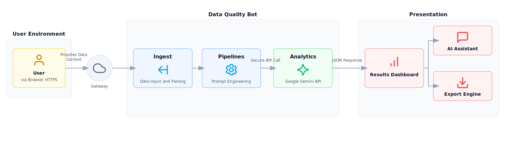

# Data Quality Bot

An intelligent bot that analyzes data metadata and profile reports to detect potential data quality issues. It identifies anomalies, schema drift, and type mismatches, evaluates business rule effectiveness, and visualizes schema relationships and issue hotspots to provide actionable recommendations.

## Problem Statement

In any data-driven organization, there's a persistent and challenging gap between high-level business requirements and their technical implementation in databases. Business stakeholders define rules in plain language— "A customer's age must be valid," "Every order must have a shipping address," or "Product SKUs should be unique." However, translating these concepts into concrete database schemas, constraints, and ETL logic is fraught with ambiguity:

*   **Vague Definitions**: What constitutes a "valid" age? Does it just mean `> 0`, or is there an upper limit? What specific format should a "shipping address" follow, especially for international customers?
*   **Implementation Gaps**: A developer might implement `UNIQUE` on a SKU column, but what happens when a data entry error introduces a duplicate with a slight variation? The database constraint might not catch it, but the business logic is violated.
*   **Evolving Logic**: Business rules change. A promotional campaign might temporarily allow negative order totals for refunds, which could conflict with a database `CHECK` constraint.
*   **Silent Failures**: The most dangerous issues are the ones that don't cause system crashes. A gradual increase in `NULL` values, a shift in the statistical distribution of a key metric, or inconsistent data formats might go unnoticed for weeks, silently corrupting downstream analytics, dashboards, and machine learning models.

This translation gap creates a breeding ground for silent data quality issues. Identifying these problems requires a deep, contextual understanding that bridges the business and technical worlds—an understanding that traditional validation tools, which often rely on rigid, predefined rules, struggle to achieve. Data teams are left with the time-consuming, manual task of data archaeology, trying to reconcile what the data *is* with what it *should be*.

## Key Features & Benefits

This tool is designed to save time, improve data reliability, and foster a data-driven culture by making data quality analysis accessible and insightful.

-   **Proactive Issue Detection**: Identify silent data corruption, schema drift, and anomalies *before* they impact downstream dashboards, machine learning models, or business decisions.
-   **AI-Powered Deep Analysis**: Go beyond traditional, rigid data validation rules. The Gemini API understands the context of your data—its structure, statistics, and business logic—to uncover subtle, complex issues that are nearly impossible to find manually.
-   **Advanced Business Rule Intelligence**: Don't just check for violations. The bot analyzes the *effectiveness* of your business rules (are they too broad? never triggered?) and detects logical *conflicts* between them, helping you refine your data governance logic.
-   **Smart Schema Visualization**: Instantly understand your data landscape. The bot automatically generates an interactive relationship diagram showing how your tables connect. Switch to the **anomaly heatmap** to immediately identify which tables are the biggest "hotspots" for data quality issues.
-   **Drastic Efficiency Gains**: Automate the tedious, time-consuming process of manual data profiling and inspection. Free up your data teams to focus on generating value from data, not just cleaning it.
-   **Improved Data Trust & Governance**: Build confidence across your organization with transparent, explainable data quality reports. The bot provides clear causes, impacts, and recommendations, making it easier to enforce data governance standards.
-   **Enhanced Collaboration**: The interactive dashboard, conversational AI assistant, and exportable PDF/PowerPoint reports make it simple to share findings and collaborate on solutions between technical and business teams.
-   **Context-Aware & Holistic**: By analyzing schemas, column statistics, sample data, and business rules together, the bot gains a holistic understanding of your data's intended state, leading to more accurate and relevant findings.

## Use Cases

The Data Quality Bot is a versatile tool for anyone who relies on high-quality data.

-   **Data Engineers**: Validate data integrity after ETL/ELT pipeline runs, detect unexpected changes from source systems, and ensure schema consistency across environments.
-   **Data Analysts & Scientists**: Ensure the reliability of datasets before performing exploratory analysis or training machine learning models. Reduce time spent on data cleaning and debugging.
-   **Data Stewards & Governance Teams**: Monitor the health of critical data assets, enforce enterprise-wide quality standards, and create a centralized view of data quality issues.
-   **Business Intelligence (BI) Developers**: Quickly troubleshoot inconsistencies in reports and dashboards by tracing them back to underlying data quality problems.

## How It Works

1.  **Provide Context**: Users input data context for one or more database tables. This includes table schemas, column-level statistics (e.g., null percentages, distinct counts), sample data rows, and business rules. Input can be provided manually or streamlined by uploading SQL files for schemas and CSV files for statistics.
2.  **AI-Powered Analysis**: The application constructs a detailed, context-rich prompt for each table and sends it to the `gemini-2.5-flash` model. The model is instructed to act as an expert data quality analyst, identifying issues based on the provided information.
3.  **Structured Results**: Gemini returns a structured JSON object containing a list of detected issues, an analysis of **business rule effectiveness and conflicts**, and data for **schema visualization**, including inferred table relationships and issue hotspots.
4.  **Visualize & Explore**: The results are displayed in an interactive dashboard. **Visualize your data structure with an interactive schema relationship diagram, or switch to an anomaly heatmap to see which tables have the most critical issues.** Users can filter all findings by severity, view a health summary for each table, and drill down into specific problems.
5.  **Conversational Insights**: A built-in chat assistant allows users to ask follow-up questions about the results in natural language, making it easy to understand complex relationships and prioritize fixes.
6.  **Export & Share**: Findings can be exported into professional, stakeholder-ready formats, including a detailed PDF report or a PowerPoint presentation.

## Architecture

### Architecture Diagram

### User Journey

 

# Run and deploy your AI Studio app

This contains everything you need to run your app locally.

View your app in AI Studio: https://ai.studio/apps/drive/1xyAamros_C8svURq2EOGfViMYlkMgmEk

## Run Locally

**Prerequisites:**  Node.js

1. Install dependencies:
   `npm install`
2. Set the `GEMINI_API_KEY` in [.env.local](.env.local) to your Gemini API key
3. Run the app:
   `npm run dev`