# Data Quality Bot

An intelligent bot that analyzes data metadata and profile reports to detect potential data quality issues like anomalies, schema drift, and type mismatches, providing actionable recommendations.

## Solution Overview

The Data Quality Bot is a powerful web application designed for data engineers, analysts, and data stewards to proactively identify and address data quality issues. By leveraging the analytical capabilities of the Google Gemini API, the application goes beyond traditional rule-based validation, uncovering subtle anomalies, schema drifts, and inconsistencies that are difficult to detect manually.

### How It Works

1.  **Provide Context**: Users input data context for one or more database tables. This includes table schemas, column-level statistics (e.g., null percentages, distinct counts), sample data rows, and business rules. Input can be provided manually or streamlined by uploading SQL files for schemas and CSV files for statistics.
2.  **AI-Powered Analysis**: The application constructs a detailed, context-rich prompt for each table and sends it to the `gemini-2.5-flash` model. The model is instructed to act as an expert data quality analyst, identifying issues based on the provided information.
3.  **Structured Results**: Gemini returns a structured JSON object containing a list of detected issues, each with a description, severity level (High, Medium, Low), possible cause, potential impact, and a recommended solution.
4.  **Visualize & Explore**: The results are displayed in an interactive dashboard where users can filter issues by severity, view a health summary for each table, and drill down into specific problems grouped by table and column.
5.  **Conversational Insights**: A built-in chat assistant allows users to ask follow-up questions about the results in natural language, making it easy to understand complex relationships and prioritize fixes.
6.  **Export & Share**: Findings can be exported into professional, stakeholder-ready formats, including a detailed PDF report or a PowerPoint presentation.

## Architecture Diagram

```mermaid
%%{
  init: {
    "theme": "base",
    "themeVariables": {
      "fontFamily": "\"Roboto\", sans-serif",
      "lineColor": "#70757A",
      "textColor": "#3C4043",
      "mainBkg": "#F8F9FA"
    }
  }
}%%
graph LR
    subgraph user_env ["User Environment"]
        direction TB
        A["💻<br><b>User via Browser</b><br>(HTTPS)"]:::userNode
    end

    subgraph gateway_sub [" "]
      B((Gateway)):::gatewayNode
    end
    
    A -- "Provides Data Context" --> B

    subgraph "bot_logic" ["Data Quality Bot (Client-Side Logic)"]
        direction LR
        subgraph ingest_sub [Ingest]
            C["📝<br><b>Data Input & Parsing</b><br>Manual, SQL/CSV Uploads"]:::processNode
        end
        subgraph pipelines_sub [Pipelines]
            D["⚙️<br><b>Prompt Engineering</b><br>Constructs contextual prompts"]:::processNode
        end
        subgraph analytics_sub [Analytics]
            E["✨<br><b>Google Gemini API</b><br>Analyzes data and returns JSON"]:::apiNode
        end
        subgraph app_sub ["Application & Presentation"]
            F["📊<br><b>Results Dashboard</b><br>Visualizes issues"]:::outputNode
            G["💬<br><b>AI Assistant</b><br>Conversational insights"]:::outputNode
            H["📤<br><b>Export Engine</b><br>Generates PDF & PPTX"]:::outputNode
        end
    end

    B --> C
    C --> D
    D -- "Secure API Call" --> E
    E -- "JSON Response" --> F
    F --> G
    F --> H
    
    %% Style Subgraphs to create the split background effect
    style user_env fill:#202124,stroke:#5F6368,color:#E8EAED
    style gateway_sub fill:transparent,stroke:transparent
    style bot_logic fill:#FFFFFF,stroke:#E0E0E0,color:#3C4043
    style ingest_sub fill:#FFFFFF,stroke:transparent
    style pipelines_sub fill:#FFFFFF,stroke:transparent
    style analytics_sub fill:#FFFFFF,stroke:transparent
    style app_sub fill:#FFFFFF,stroke:transparent

    %% Style Nodes for a professional, GCP-like feel
    classDef userNode fill:#FEF7E0,stroke:#FBBC05,stroke-width:2px,color:#3C4043
    classDef gatewayNode fill:#F1F3F4,stroke:#70757A,stroke-width:2px,color:#3C4043
    classDef processNode fill:#E8F0FE,stroke:#4285F4,stroke-width:2px,color:#3C4043
    classDef apiNode fill:#E6F4EA,stroke:#34A853,stroke-width:2px,color:#3C4043
    classDef outputNode fill:#FCE8E6,stroke:#EA4335,stroke-width:2px,color:#3C4043
```

  <b>Architecture: General > Data Quality Analysis > Client-Side AI Processing</b>

## User Journey

The following diagram illustrates the typical workflow a user follows when interacting with the Data Quality Bot, from providing initial data to exporting final, actionable insights.

```mermaid
%%{
  init: {
    "theme": "base",
    "themeVariables": {
      "fontFamily": "\"Roboto\", sans-serif",
      "primaryColor": "#FFFFFF",
      "primaryTextColor": "#3C4043",
      "primaryBorderColor": "#4285F4",
      "lineColor": "#70757A",
      "textColor": "#3C4043",
      "mainBkg": "#F8F9FA",
      "clusterBkg": "#FFFFFF",
      "clusterBorder": "#E0E0E0"
    }
  }
}%%
graph TD
    subgraph "1. Start"
        A[👨‍💻 User Opens App]:::startNode
    end

    subgraph "2. Input Phase"
        B{Provide Data Context}:::inputNode
        B1[📝 Manually enters data]:::inputNode
        B2[📤 Uploads SQL & CSV files]:::inputNode
    end
    
    subgraph "3. Analysis Phase"
        C[🚀 Clicks 'Analyze Data']:::analysisNode
        D["🤖 Bot calls Gemini API"]:::analysisNode
        E["✨ Receives structured issues"]:::analysisNode
    end

    subgraph "4. Insight & Action Phase"
        F[📊 Views Interactive Dashboard]:::insightNode
        F1[🔍 Filters issues]:::insightNode
        F2[🩺 Reviews Table Health]:::insightNode
        G[💬 Opens AI Chat Assistant]:::insightNode
        H[📜 Generates AI Summary]:::insightNode
        I[📤 Exports Reports]:::insightNode
        I1[📄 Detailed PDF]:::insightNode
        I2[💻 PowerPoint Slides]:::insightNode
    end
    
    subgraph "5. Goal"
       J[✅ Actionable Insights Gained]:::goalNode
    end

    A --> B
    B --> B1
    B --> B2
    B1 --> C
    B2 --> C
    C --> D
    D --> E
    E --> F
    F --> F1 & F2 & G & H
    H --> I
    I --> I1 & I2
    I1 --> J
    I2 --> J
    G --> J

    %% Class Definitions
    classDef startNode fill:#E8F0FE,stroke:#4285F4,stroke-width:2px
    classDef inputNode fill:#FEF7E0,stroke:#FBBC05,stroke-width:2px
    classDef analysisNode fill:#FCE8E6,stroke:#EA4335,stroke-width:2px
    classDef insightNode fill:#E6F4EA,stroke:#34A853,stroke-width:2px
    classDef goalNode fill:#E8EAF6,stroke:#3F51B5,stroke-width:2px
```

  <b>User Journey: From Data Input to Actionable Insights</b>

# Run and deploy your AI Studio app

This contains everything you need to run your app locally.

View your app in AI Studio: https://ai.studio/apps/drive/1xyAamros_C8svURq2EOGfViMYlkMgmEk

## Run Locally

**Prerequisites:**  Node.js

1. Install dependencies:
   `npm install`
2. Set the `GEMINI_API_KEY` in [.env.local](.env.local) to your Gemini API key
3. Run the app:
   `npm run dev`