<div align="center">

</div>

# Data Quality Bot

An intelligent bot that analyzes data metadata and profile reports to detect potential data quality issues like anomalies, schema drift, and type mismatches, providing actionable recommendations.

## Solution Overview

The Data Quality Bot is a powerful web application designed for data engineers, analysts, and data stewards to proactively identify and address data quality issues. By leveraging the analytical capabilities of the Google Gemini API, the application goes beyond traditional rule-based validation, uncovering subtle anomalies, schema drifts, and inconsistencies that are difficult to detect manually.

### How It Works

1.  **Provide Context**: Users input data context for one or more database tables. This includes table schemas, column-level statistics (e.g., null percentages, distinct counts), sample data rows, and business rules. Input can be provided manually or streamlined by uploading SQL files for schemas and CSV files for statistics.
2.  **AI-Powered Analysis**: The application constructs a detailed, context-rich prompt for each table and sends it to the `gemini-2.5-flash` model. The model is instructed to act as an expert data quality analyst, identifying issues based on the provided information.
3.  **Structured Results**: Gemini returns a structured JSON object containing a list of detected issues, each with a description, severity level (High, Medium, Low), possible cause, potential impact, and a recommended solution.
4.  **Visualize & Explore**: The results are displayed in an interactive dashboard where users can filter issues by severity, view a health summary for each table, and drill down into specific problems grouped by table and column.
5.  **Conversational Insights**: A built-in chat assistant allows users to ask follow-up questions about the results in natural language, making it easy to understand complex relationships and prioritize fixes.
6.  **Export & Share**: Findings can be exported into professional, stakeholder-ready formats, including a detailed PDF report or a PowerPoint presentation.

## Architecture Diagram

This application utilizes a simple, robust client-side architecture. The React frontend communicates directly and securely with the Google Gemini API to perform data quality analysis. There is no backend server, which simplifies deployment and reduces maintenance overhead.

```mermaid
graph TD
    subgraph "User's Browser"
        A["👨‍💻<br/>User"] --> B{Data Quality Bot<br/>(React App)};
    end

    subgraph "1. Data Input Methods"
        B --> C1["📝<br/>Manual Input<br/>(Schema, Stats, Samples)"];
        B --> C2["📄<br/>File Upload<br/>(SQL & CSV)"];
    end

    subgraph "2. AI Analysis Core"
        C1 & C2 --> D["⚙️<br/>Prompt Engineering<br/>(Contextual prompts per table)"];
        D --> E["🤖<br/>Google GenAI SDK"];
        E -- "Secure API Call (HTTPS)" --> F["✨<br/>Gemini 2.5 Flash API"];
        F -- "Structured JSON<br/>(Data Quality Issues)" --> E;
    end
    
    subgraph "3. Interactive Results & Insights"
        E --> G["📊<br/>Results Dashboard<br/>(Health, Hotspots, Filtering)"];
        G --> H["💬<br/>Conversational Assistant<br/>(Ask follow-up questions)"];
        G --> I["📜<br/>AI Summary Generation"];
        G --> J["📤<br/>Export Engine<br/>(PDF & PowerPoint)"];
    end

    subgraph "4. User Actions"
        G & H & I & J --> A;
    end

    style A fill:#e3f2fd,stroke:#333
    style B fill:#e0f7fa,stroke:#00796b
    style C1 fill:#fffde7,stroke:#333
    style C2 fill:#fffde7,stroke:#333
    style D fill:#fce4ec,stroke:#ad1457
    style E fill:#fce4ec,stroke:#ad1457
    style F fill:#ede7f6,stroke:#5e35b1
    style G fill:#e8f5e9,stroke:#2e7d32
    style H fill:#e8f5e9,stroke:#2e7d32
    style I fill:#e8f5e9,stroke:#2e7d32
    style J fill:#e8f5e9,stroke:#2e7d32
```

## User Journey

The following diagram illustrates the typical workflow a user follows when interacting with the Data Quality Bot, from providing initial data to exporting final, actionable insights.

```mermaid
graph LR
    subgraph "Start"
        A[👨‍💻 User Opens App] --> B{Provide Data Context};
    end

    subgraph "Input Phase"
        B -- "Option 1" --> B1[📝 Manually enters<br/>schema, stats, etc.];
        B -- "Option 2" --> B2[📤 Uploads SQL file<br/>for schema & rules];
        B2 --> B3[📤 Uploads CSV file<br/>for column statistics];
    end

    subgraph "Analysis Phase"
        B1 & B3 --> C[Clicks 'Analyze Data Quality'];
        C --> D["🤖 Bot sends context to<br/>Gemini API for analysis"];
        D --> E["✨ Gemini returns a<br/>structured list of issues"];
    end

    subgraph "Insight & Action Phase"
        E --> F[📊 Views Interactive Dashboard];
        F --> F1[🔍 Filters issues by<br/>severity or table];
        F --> F2[🩺 Reviews Table Health<br/>and Issue Hotspots];
        F --> G[💬 Opens Chat Assistant];
        G --> G1[🗣️ Asks follow-up questions<br/>about the results];
        F --> H[📜 Generates AI Summary];
        H --> I[📤 Exports Report];
        I -- "Detailed" --> I1[📄 PDF Format];
        I -- "Presentation" --> I2[💻 PowerPoint Format];
    end

    subgraph "End"
       I1 & I2 --> J[✅ User has actionable insights];
    end
```




# Run and deploy your AI Studio app

This contains everything you need to run your app locally.

View your app in AI Studio: https://ai.studio/apps/drive/1xyAamros_C8svURq2EOGfViMYlkMgmEk

## Run Locally

**Prerequisites:**  Node.js


1. Install dependencies:
   `npm install`
2. Set the `GEMINI_API_KEY` in [.env.local](.env.local) to your Gemini API key
3. Run the app:
   `npm run dev`